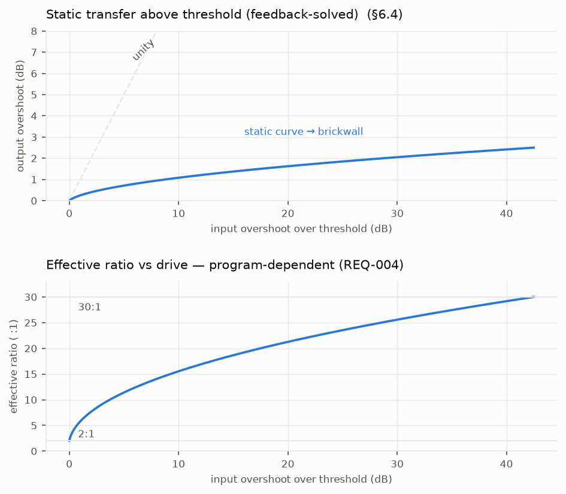
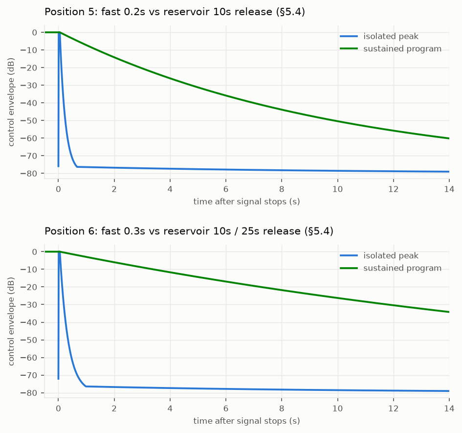

# Tekkchild Model 670 (TA-670)

A world-class **vari-mu tube limiter/compressor plugin** in the lineage of the
legendary Fairchild 660/670 — dual-channel, feedback-detecting, with
program-dependent ratio (≈ 2:1 → 30:1), a naturally soft knee, six switchable
attack/release time constants (0.2 ms attack; releases from 0.3 s to a
program-dependent 25 s), and **dual-mono / stereo / Mid-Side (LAT-VERT)**
operation for mixing, mastering, and vinyl-cutting workflows.

## 📐 Specification

The complete engineering specification — DSP math, analog reference
architecture, control surface, real-time C++ coding standards, numerical
methods, and the test/performance plan — lives in:

**[SPECIFICATION.md](./SPECIFICATION.md)**

| Section | Contents |
|---|---|
| §1 | Purpose, measurable requirements (REQ-001…014), sonic targets |
| §2 | Analog reference architecture (tubes, transformers, sidechain) |
| §3 | System signal flow & feedback topology |
| §4 | Variable-mu gain element: nonlinear tube model |
| §5 | Detection sidechain, six time constants, multi-reservoir release |
| §6 | Static law: soft knee, thresholds, emergent 2:1→30:1 ratio |
| §7 | Stereo / dual-mono / M-S (LAT/VERT) matrix & linking |
| §8 | Transformer, tube & noise coloration |
| §9 | Oversampling & anti-aliasing |
| §10 | Full parameter tables |
| §11 | Metering (GR + IEC VU ballistics) & calibration |
| §12 | Software architecture & real-time coding standards |
| §13 | Numerical methods, precision & stability |
| §14 | Testing, validation & performance budgets |

## ✅ Validated mathematics

The spec's math is executable, not aspirational. `tools/validate_spec.py`
implements the governing equations independently and gates on eight checks
(C1–C8): the one-pole coefficient identity, soft-knee C¹ continuity, the
emergent feedback ratio (2:1 → 30:1), the multi-reservoir program-dependent
release (0.2 s / 10 s / 25 s), M-S null reconstruction, push-pull even-harmonic
cancellation, and IEC VU ballistics. Figures land in
[`docs/validation/`](./docs/validation/):

| | |
|---|---|
|  |  |

```sh
pip install numpy matplotlib
python3 tools/validate_spec.py     # exit 0 iff all 8 checks pass
```

## 🧱 C++20 DSP core (skeleton)

`src/dsp/` holds the framework-free, header-only core mandated by §12 — the
vari-mu gain cell (LUT-backed, no per-sample transcendentals), the
multi-reservoir sidechain, the feedback channel loop, the soft-knee gain
computer, the orthonormal M-S matrix, GR/VU meter ballistics, the §9
oversampler (Kaiser half-band FIR cascade, exact integer latency 79/87/90/92
base samples, round-trip nulls ≤ −124 dB, alias floor −139 dBc at 4×; plus
the Eco-mode elliptic polyphase-IIR halfband — 8 allpass sections, −107 dB
stopband, zero reported latency), the §8 coloration model (transformer flux
saturation, tube residual, calibrated noise floor), and the §3 stereo
**Engine** integrating dual-mono/stereo/M-S modes, sidechain linking, and
delay-compensated dry/wet mix. `src/params/` implements the §10 parameter
table with tapers, dezippering, and wait-free snapshot publication. A
dependency-free unit-test binary mirrors §14.2:

```sh
cmake -B build -DCMAKE_BUILD_TYPE=Release
cmake --build build
./build/ta670_tests                # 24/24 assertions PASS
```

Built with `-Wall -Wextra -Wpedantic -Werror -Wconversion -Wshadow` per the
coding standard; the suite also runs clean under ASan+UBSan.

## Status

**Specification draft v0.1.0** with validated math and a tested DSP core
covering §3–§11 (engine, gain cell, sidechain, knee, M-S + linking,
coloration, FIR & IIR oversampling, parameters, meters). Next milestone: the
CLAP/VST3/AU plugin adapters and GUI (§12).
