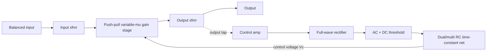
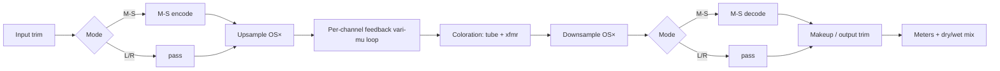

# Tekkchild Model 670 — Vari-Mu Compressor Plugin

### Engineering Specification & DSP Design Document

| Field | Value |
|---|---|
| Document status | Draft |
| Version | 0.1.0 |
| Date | 2026-07-17 |
| Classification | Engineering Specification |
| Audience | DSP / real-time-audio / plugin engineers |
| Codename | TA-670 |

---

## Abstract

The Tekkchild Model 670 is a software emulation of a dual-channel, variable-mu
(remote-cutoff vacuum-tube) limiter/compressor in the lineage of the Fairchild
660/670. It reproduces the defining behaviors of the hardware: **feedback-type**
level detection, a **program-dependent** compression ratio that rises smoothly
from roughly 2:1 on small peaks to brick-wall (~30:1) on loud transients, a
naturally **soft knee**, six switchable attack/release time constants (including
multi-stage program-dependent release out to 25 s), single push-pull gain stages
whose symmetry yields a predominantly **odd-harmonic** signature, and
independent **dual-mono / stereo / Mid-Side (LAT-VERT)** operation for mastering
and vinyl-cutting workflows.

The plugin is engineered as a physically-motivated, **oversampled**,
zero-latency-optional DSP system with a portable, framework-independent C++ core
held to strict real-time-safety standards. This document specifies the acoustic
targets, the mathematical models of every processing block, the control surface,
the numerical methods, the software architecture and coding standards, and the
test and performance budgets required to build and validate the product to a
world-class bar.

---

## Scope & Non-Goals

**In scope.** The complete DSP signal chain (gain cell, detection sidechain,
static law, M-S matrixing, coloration, oversampling), the parameter model and
metering, the real-time C++ architecture, numerical methods, and the
verification/performance plan.

**Non-goals.** This is a *behavioral / structural* model, not a node-by-node
SPICE netlist. Where a physically-grounded closed form and a cheap, perceptually
equivalent approximation both exist, the specification mandates the approximation
for the real-time path and reserves the closed form for offline validation. GUI
visual design, installer/licensing, and DRM are out of scope for this revision.

---

## Document Conventions

- **Units** are SI unless a dB reference is given. Levels are dBFS unless
  suffixed (`dBu`, `dBVU`). Sample rate is `fs` (Hz); the internal oversampled
  rate is `fs' = OS · fs`.
- **Math** uses GitHub math notation: inline $y=\alpha x$ and display blocks.
- **Code** is C++20 in `cpp` fences; it is illustrative reference, not the
  shipping source.
- **Requirements** are identified `REQ-NNN` and are individually testable
  (see §1 and §14).
- **Cross-references** use the section sign, e.g. "see §5.3".
- `⌊·⌋`, `clamp(x,a,b)`, and `sat(·)` have their usual meanings.

---

## Notation & Symbols

| Symbol | Meaning | Units |
|---|---|---|
| $x[n]$, $y[n]$ | input / output audio sample | — (normalized) |
| $f_s$, $f_s'$ | host sample rate, oversampled rate | Hz |
| $T_s = 1/f_s'$ | oversampled sample period | s |
| $\tau_a$, $\tau_r$ | attack / release time constant (1/e) | s |
| $\alpha$ | one-pole smoothing coefficient | — |
| $V_c$ | tube control voltage (grid-bias offset) | V (model) |
| $G(V_c)$, $g_{dB}$ | linear voltage gain / gain in dB of the cell | —, dB |
| $g_m$ | tube transconductance | S |
| $L_i$, $L_o$ | input / output level (log domain) | dB |
| $T$ | threshold | dB |
| $W$ | knee width | dB |
| $R$ | compression ratio | — |
| $k$ | feedback gain-law slope, $R = 1+k$ | dB/dB |
| $e[n]$ | detector envelope | linear or dB |
| $M$, $S$ | Mid / Side signals | — |
| $\zeta$, $\omega_n$ | damping ratio, natural frequency (VU model) | —, rad/s |
| $\beta$ | cubic waveshaper coefficient | — |
| $\Phi$ | transformer core flux (model) | Wb (model) |

---

## Glossary

- **Variable-mu** — a tube whose amplification factor μ (and transconductance
  $g_m$) varies with grid bias; the basis of the 670's gain reduction.
- **Remote-cutoff tube** — a tube with a graded control grid so $g_m$ falls off
  *gradually* as bias goes negative (rather than sharply), giving a wide,
  smooth AGC range without clipping.
- **Feedback vs feedforward detection** — feedback derives the control signal
  from the *output* (post-gain) signal; feedforward from the *input*. The 670 is
  feedback-type, which yields its program-dependent ratio (§6.4).
- **Soft knee** — a gradual transition from unity to compressing gain around
  threshold, rather than a hard corner.
- **Program-dependent release** — a release whose effective time constant grows
  with sustained energy (fast for isolated peaks, slow for dense program).
- **Mid-Side (M-S) / LAT-VERT** — an orthogonal representation of a stereo
  signal into sum (Mid/lateral) and difference (Side/vertical) components.
- **Oversampling (OS)** — running nonlinear stages at $N\times f_s$ to keep
  alias products out of the audio band.
- **VU** — Volume Unit meter with standardized 300 ms ballistics (IEC 60268-17).
- **True peak** — inter-sample peak estimated on an oversampled signal
  (ITU-R BS.1770).
- **RT-safety** — the property that audio-thread code never allocates, locks,
  blocks, or otherwise incurs unbounded latency.

---

## References & Further Reading

1. U. Zölzer (ed.), *DAFX: Digital Audio Effects*, 2nd ed., Wiley, 2011.
2. J. D. Reiss & A. McPherson, *Audio Effects: Theory, Implementation and
   Application*, CRC Press, 2014.
3. W. Pirkle, *Designing Audio Effect Plugins in C++*, 2nd ed., Focal Press, 2019.
4. V. Zavalishin, *The Art of VA Filter Design*, rev. 2.1.2, 2020 (TPT/ZDF).
5. N. Koren, "Improved vacuum tube models for SPICE simulations," 1996–2003.
6. D. T. Yeh, J. Abel, J. O. Smith, "Automated Physical Modeling of Nonlinear
   Audio Circuits," *IEEE TASLP*, 2010.
7. R. Kuehnel, *Circuit Analysis of a Legendary Tube Amplifier* (transformer &
   push-pull modeling background).
8. G. W. McNally, "Dynamic Range Control of Digital Audio Signals," *JAES*,
   1984.
9. J. S. Abel & D. P. Berners, "On peak-detecting and RMS feedback and
   feedforward compressors," AES 115th Convention, 2003.
10. D. Giannoulis, M. Massberg, J. D. Reiss, "Digital Dynamic Range Compressor
    Design—A Tutorial and Analysis," *JAES* 60(6), 2012.
11. IEC 60268-17, *Sound system equipment — Part 17: Standard volume indicators*.
12. ITU-R BS.1770-4, *Algorithms to measure audio programme loudness and
    true-peak audio level*.
13. Fairchild Model 670 / 660 operating & service literature (behavioral
    reference).

---

## Table of Contents

1. [Purpose, Scope & Sonic Design Goals](#1-purpose-scope--sonic-design-goals)
2. [Analog Reference Architecture (Model 670)](#2-analog-reference-architecture-model-670)
3. [System Signal Flow & Processing Topology](#3-system-signal-flow--processing-topology)
4. [The Variable-Mu Gain Element: Nonlinear Model](#4-the-variable-mu-gain-element-nonlinear-model)
5. [Detection Sidechain & Program-Dependent Envelope](#5-detection-sidechain--program-dependent-envelope)
6. [Static Compression Law: Knee, Ratio & Threshold](#6-static-compression-law-knee-ratio--threshold)
7. [Stereo, Dual-Mono & Mid-Side (LAT/VERT) Architecture](#7-stereo-dual-mono--mid-side-latvert-architecture)
8. [Analog Coloration: Transformers, Tubes & Noise](#8-analog-coloration-transformers-tubes--noise)
9. [Oversampling & Anti-Aliasing](#9-oversampling--anti-aliasing)
10. [Control Surface & Parameter Specification](#10-control-surface--parameter-specification)
11. [Metering & Calibration](#11-metering--calibration)
12. [Software Architecture & Real-Time Coding Standards](#12-software-architecture--real-time-coding-standards)
13. [Numerical Methods, Precision & Stability](#13-numerical-methods-precision--stability)
14. [Testing, Validation, QA & Performance Targets](#14-testing-validation-qa--performance-targets)

---

## 1. Purpose, Scope & Sonic Design Goals

### 1.1 Product summary

The TA-670 is a two-channel variable-mu dynamics processor plugin. Each channel
is a self-contained feedback limiter/compressor whose gain is produced by a
modeled remote-cutoff tube stage. The two channels can run as independent
dual-mono processors, as a linked stereo pair, or on the Mid/Side (LAT/VERT)
components of a stereo program.

### 1.2 Non-goals

Component-level SPICE emulation, guaranteed sample-exact match to any specific
serial-numbered hardware unit, and modeling of hardware faults (microphonics,
aged components) are explicitly out of scope. The target is the *canonical*
behavior of a well-maintained unit.

### 1.3 Requirements

| ID | Requirement | Rationale | Acceptance criterion (see §14) |
|---|---|---|---|
| REQ-001 | Feedback (output-derived) detection topology | Source of program-dependent ratio & smoothness | Loop verified in §3.3; ratio curve REQ-004 met |
| REQ-002 | Soft-knee static curve | Hardware has a gentle knee | Measured knee transition ≥ 6 dB wide at default; matches §6.2 model within 0.3 dB |
| REQ-003 | Six attack/release positions per §5.5 | Faithful control set | Measured $\tau$ within ±10% of Table 5.1; program-dependent positions exhibit multi-stage release |
| REQ-004 | Program-dependent ratio ~2:1 → ~30:1 | Defining vari-mu behavior | Effective slope rises monotonically with drive; ≥ 20:1 at +20 dB over threshold |
| REQ-005 | Fastest attack ≤ 0.1 ms reachable; overall release 0.3–25 s | Advertised control range | Measured limits within tolerance |
| REQ-006 | Dual-mono, stereo-linked, and M-S modes | Mastering/vinyl versatility | Mode matrix nulls to −120 dB when bypassed (§7.2) |
| REQ-007 | Odd-harmonic-dominant coloration under limiting; low THD as through-amp | Push-pull character | THD_2/THD_3 ratio ≤ −20 dB at nominal; through-amp THD+N ≤ −90 dB (color off) |
| REQ-008 | Alias products ≥ 100 dB below full scale (High mode) | Transparent nonlinearity | Two-tone test (§14.4) meets bound at each OS mode |
| REQ-009 | Selectable oversampling with reported latency | Quality/CPU trade-off | Latency reported to host exactly equals filter group delay (§9.4) |
| REQ-010 | Noise floor ≤ −110 dBFS with coloration off; modeled hiss/hum optional | "Vanishingly low noise" | Idle RMS measured; optional generator level-calibrated |
| REQ-011 | Zero-latency mode available (min-phase / 1× or IIR) | Tracking/live use | End-to-end latency = 0 samples in this mode |
| REQ-012 | Sample rates 44.1–192 kHz; 1–2 channels | Standard host support | Passes pluginval at all rates (§14.5) |
| REQ-013 | RT-safe audio thread (no alloc/lock/IO) | Reliability | TSan/manual audit clean (§12.3, §14.5) |
| REQ-014 | CPU ≤ budgets in §14.6 | Usability in dense sessions | Meets per-mode budget on reference machine |

### 1.4 Sonic design goals as measurements

- **GR onset**: with a slow-rising sine sweep, gain reduction shall begin below
  threshold with < 1 dB GR (soft knee) and increase smoothly — no discontinuity
  in $dG/dL_i$.
- **Static curve**: input→output within ±0.3 dB of the §6 model over
  −60…0 dBFS at each ratio setting.
- **Harmonic signature**: at 6 dB GR on a −10 dBFS 1 kHz tone (coloration on,
  default), 3rd harmonic dominant; 2nd harmonic ≥ 12 dB below 3rd (push-pull
  symmetry).
- **Null vs reference**: an offline high-quality render (16× OS, double
  precision) shall serve as golden reference; the real-time High mode shall null
  against it to ≤ −60 dBFS residual on program material.

### 1.5 Platforms & formats

Formats: **CLAP** (primary), **VST3**, **AU** (macOS), **AAX** (Pro Tools).
OS: Windows 10+ (x86-64), macOS 11+ (x86-64 + arm64 universal), Linux
(x86-64, CLAP/VST3). Sample rates 44.1/48/88.2/96/176.4/192 kHz. Channel
configs: mono→mono, stereo→stereo. See §12 for the wrapper strategy.

---

## 2. Analog Reference Architecture (Model 670)

This section describes the hardware behavior the DSP model must reproduce. It is
descriptive; the governing equations appear in §4–§6.

### 2.1 The variable-mu gain principle

Each channel's audio passes through a **push-pull stage built on remote-cutoff
twin-triode tubes**. In a remote-cutoff (variable-mu) tube, the control grid is
wound with variable pitch so that transconductance $g_m$ — and hence stage gain —
declines *gradually* as the grid is biased more negative. A high, smoothly
varying **control voltage** $V_c$ applied to the grids therefore acts as a clean,
wideband gain-control element: increasing $V_c$ (more negative bias) reduces
$g_m$, reducing gain. Because the reduction is achieved by moving the tube's
operating point rather than by clipping, and because the control voltage is
large and slew-limited, the stage produces gain reduction without the thumps and
zipper artifacts of fast electronic attenuators.

Push-pull operation is central to the sound: the two halves process
anti-phase copies, so **even-order distortion products cancel** at the output
transformer and the residual nonlinearity is **odd-order dominant** (§4.3).

### 2.2 Signal, control, and coupling transformers

The unit is transformer-coupled throughout. A plausible accounting toward the
**11 custom transformers** and **20 tubes** of a stereo unit:

| Function | Qty (approx.) | Role we model |
|---|---|---|
| Input transformers | 2 | Balanced input, LF saturation, HF bandwidth |
| Interstage / phase-splitter | 2 | Drives push-pull halves |
| Output transformers | 2 | Sums push-pull, saturates on LF/level |
| Sidechain / control transformers | 2–3 | Rectifier coupling |
| Power/bias (not audio) | remainder | Not modeled acoustically |
| Gain, amplifier & rectifier tubes | 20 total | Gain cell + control amp + rectifier |

Only the **audio-path** transformers (input, interstage, output) and the tube
harmonic behavior are modeled acoustically (§8); power and bias components affect
only headroom/noise constants.

### 2.3 The control (sidechain) path

The control chain, per channel, is: **output-derived tap → control amplifier →
full-wave rectifier → threshold/bias network → dual time-constant RC network →
control-voltage line to the grids.** Two aspects are essential:

1. **Feedback detection.** The rectifier senses the *amplifier output*, not the
   input. The loop that results (output ← gain ← control ← rectified output)
   is what produces the program-dependent ratio and self-smoothing behavior
   (§3.3, §6.4).
2. **Two thresholds.** A **front-panel AC threshold** (the continuously variable
   THRESHOLD control) sets how much rectified signal is required before the
   control line moves — i.e., the operating threshold and drive. An **internal
   DC-threshold trim** sets the *bias standing point* and thereby the **knee
   hardness**: from a seamless compression-to-limiting transition (wide, soft
   knee) to a harder, more pronounced knee.

### 2.4 The time-constant network

The RC network between rectifier and grid line implements the six selectable
**attack/release** constants. Positions 1–4 are single attack/release pairs.
Positions 5 and 6 add **reservoir capacitors** that charge under sustained
limiting, producing a *fast* release for isolated peaks and progressively
*slower* release (10 s, and for Position 6, 25 s) as the program stays hot. This
dual/multi-capacitor topology is modeled explicitly in §5.4.

### 2.5 LAT/VERT vs LEFT/RIGHT

A global mode switch reinterprets the two channels. In **LEFT/RIGHT** the
channels process the stereo pair directly. In **LAT/VERT** an M-S matrix feeds
the channels the **lateral (Mid/sum)** and **vertical (Side/difference)**
components — the same quantities a disc-cutting lathe treats as horizontal groove
width and vertical depth. This is the hook for modern Mid/Side mastering (§7).

### 2.6 Reference block diagram



---

## 3. System Signal Flow & Processing Topology

### 3.1 Top-level pipeline



Rationale for stage order: **M-S matrixing is done at base rate** (it is linear
and needs no oversampling), the **nonlinear loop and coloration run oversampled**
(§9), and metering taps the base-rate signal after downsampling.

### 3.2 Per-sample processing skeleton

Each oversampled channel executes, per sample, the loop in §3.3. The
block-level driver is:

```cpp
// One channel, one oversampled block. RT-safe: no alloc, no locks.
void Channel::processOversampled(float* buf, int nFrames) noexcept {
    for (int n = 0; n < nFrames; ++n) {
        const float in  = buf[n];
        const float g   = gainCell_.currentGain();     // G(Vc) from prev step
        const float out = gainCell_.process(in * g);   // apply + tube shaping (§4)
        const float det = detector_.rectify(out);      // FEEDBACK: sense output (§5)
        const float vc  = sidechain_.update(det);       // env -> control voltage (§5,§6)
        gainCell_.setControl(vc);                        // sets next-sample gain
        buf[n] = coloration_.process(out);              // xfmr/tube color (§8)
    }
}
```

Note the **one-sample delay** in the control path (`currentGain()` uses the
previous step's $V_c$): this is the pragmatic resolution of the delay-free
feedback loop and is analyzed in §13.2.

### 3.3 Feedback loop model

Let $x[n]$ be the input, $G(\cdot)$ the gain-cell law, $D(\cdot)$ the detector +
smoother mapping a signal history to a control voltage, and $z^{-1}$ the unit
delay. The realized system is:

$$
y[n] = G\big(V_c[n]\big)\, x[n], \qquad
V_c[n] = D\big(y[n-1]\big).
$$

Because $V_c[n]$ depends on $y[n-1]$ (delayed output), the loop is **causal and
computable without iteration**. The closed-loop static behavior — solving the
fixed point $y = G(D(y))\,x$ — is what gives the program-dependent ratio derived
in §6.4. The one-sample delay's effect on the effective attack is bounded by
$T_s = 1/f_s'$ and is negligible at oversampled rates (§13.2), but a
zero-delay-feedback (ZDF) alternative is specified there for the 1× path.

### 3.4 Latency & routing

Total reported latency = oversampling filter group delay (§9.4) + any lookahead
(default 0). M-S matrixing, gain, and coloration add **zero** latency. The dry
path used for `Mix` is delay-compensated to match.

---

## 4. The Variable-Mu Gain Element: Nonlinear Model

### 4.1 Physical basis: remote-cutoff transconductance

For a remote-cutoff tube the transconductance falls off gradually with
increasingly negative grid-cathode voltage $V_{gk}$. A tractable, monotone model
that captures the "remote" (extended, exponential-tailed) cutoff is

$$
g_m(V_{gk}) = g_{m0}\,\exp\!\big(V_{gk}/V_\gamma\big), \qquad V_{gk} \le 0,
$$

where $g_{m0}$ is the zero-bias transconductance and $V_\gamma>0$ sets how
quickly $g_m$ decays (the "remoteness" of cutoff). Small-signal stage gain is
proportional to $g_m$ times the effective plate load $R_L$:

$$
G = g_m R_L = \underbrace{g_{m0}R_L}_{G_0}\,\exp\!\big(V_{gk}/V_\gamma\big).
$$

Writing the control voltage as the *added* negative bias $V_c \ge 0$
($V_{gk}=V_{gk0}-V_c$), the **gain law in dB is linear in $V_c$** over the
working range — precisely the property that makes remote-cutoff tubes excellent,
low-distortion gain controllers:

$$
\boxed{\,g_{dB}(V_c) = 20\log_{10}G_0 - \frac{20}{\ln 10}\,\frac{V_c}{V_\gamma}
\;=\; g_{dB,0} - k_0\,V_c\,}
\qquad k_0 = \frac{20}{\ln 10\;V_\gamma}\ \text{[dB/V]}.
$$

### 4.2 Practical parametric gain law

The shipping model expresses gain reduction directly in dB as a function of a
normalized control envelope $u\in[0,1]$ (from §5), with a **soft tail** so that
gain reduction accelerates gently at high drive (the physical $g_m$ curve
steepens near cutoff):

$$
g_{dB}(u) = -\,G_\text{max}\Big[(1-\theta)\,u + \theta\,u^{p}\Big],
\qquad p>1,\ \theta\in[0,1],
$$

with $G_\text{max}$ the maximum reduction (e.g. 40 dB), $p$ the tail exponent
(≈ 1.5–3), and $\theta$ the tail weight set by the **DC-threshold trim** (§6.3).
The linear multiplier applied to audio is $G = 10^{g_{dB}/20}$.

**Calibration (normative).** Given target ratios $R_0$ at grazing drive and
$R_1$ at full drive (§6.4), a maximum reduction $G_\text{max}$, and a control
range $U$ (the output-overshoot span in dB over which $u$ traverses $[0,1]$),
the law's parameters are fixed by the two slope constraints
$k(0)=R_0-1$, $k(1)=R_1-1$:

$$
\theta = 1 - \frac{(R_0-1)\,U}{G_\text{max}}, \qquad
p = \frac{(R_1-R_0)\,U}{G_\text{max}\,\theta},
$$

with admissibility $0<\theta<1$, $p>1$. Defaults $R_0=2$, $R_1=30$,
$G_\text{max}=40$ dB, $U=2.5$ dB give $\theta = 0.9375$, $p \approx 1.8667$
(validated numerically in `tools/validate_spec.py`, check C4).

The *local slope* $k(u) = -\,dg_{dB}/du \cdot du/dL_i$ is the quantity that, via
the feedback loop, becomes the compression ratio $R=1+k$ (§6.4); its growth with
$u$ is the mathematical origin of program-dependent ratio.

### 4.3 Large-signal shaping and push-pull odd symmetry

Beyond gain control, the stage adds harmonic color. Model each push-pull half as
a smooth saturating nonlinearity $f_\pm$. The differential output of a balanced
pair is **odd**:

$$
y = \tfrac12\big[f(x) - f(-x)\big] = a_1 x + a_3 x^3 + a_5 x^5 + \cdots
$$

— even terms cancel by construction (REQ-007). A minimal, well-behaved choice is
the cubic-tanh hybrid

$$
y = \tanh(a_1 x)\ \approx\ a_1 x - \tfrac{a_1^3}{3}x^3 + \cdots,
\qquad \beta \equiv \tfrac{a_1^3}{3}.
$$

For a tone $x=A\sin\omega t$, the cubic term yields a **3rd harmonic** of
amplitude $\tfrac14\beta A^3$ and no 2nd harmonic, so
$\mathrm{THD} \approx \tfrac14\beta A^2$ grows with level and with GR — matching
the hardware's "clean through-amp, characterful under limiting" behavior. A
small, deliberately injected 2nd-harmonic term (asymmetry trim, default −24 dB
vs 3rd) models real-world tube/transformer imbalance without violating REQ-007.

### 4.4 Real-time-safe evaluation

$g_{dB}(u)$ and the shaper are evaluated per oversampled sample. To avoid
per-sample `exp`/`pow`, both are precomputed into **guard-banded lookup tables**
with linear (or cubic-Hermite) interpolation; table regeneration happens off the
audio thread when $G_\text{max},\theta,p$ change (§12.3).

```cpp
struct GainCell {
    // uTable: g_dB as function of normalized control u in [0,1], 1024 pts.
    // shaper: odd tanh-style waveshaper LUT, oversampled domain.
    float currentGain() const noexcept { return gLin_; }           // 10^(gdB/20)
    void  setControl(float u) noexcept {
        const float gdB = lut::interp(uTable_, clampUnit(u));
        gLin_ = fastExp10(0.05f * gdB);                            // table-backed
    }
    float process(float driven) const noexcept {
        return lut::interp(shaper_, driven);                       // odd, band-limited
    }
};
```

Ranges: $G_\text{max}\in[0,60]$ dB, $\theta\in[0,1]$, $p\in[1,4]$,
2nd-harmonic trim $\in[-\infty,-12]$ dB. All parameters are smoothed (§10.4).

---

## 5. Detection Sidechain & Program-Dependent Envelope

### 5.1 Rectification and level estimation

The detector senses the **output** (feedback, §3.3). Rectification is modeled as
a full-wave absolute value followed by an optional light pre-smoothing, then a
log conversion so that thresholding and ratio act in the dB domain (numerically
well-conditioned across 120 dB):

$$
r[n] = |y[n-1]|, \qquad
\ell[n] = 20\log_{10}\!\big(\max(r[n],\varepsilon)\big),\quad \varepsilon = 10^{-6}.
$$

A quasi-peak detector (fast attack to the rectified value, controlled release)
is the primary path; an optional RMS window models the tube's thermal
integration for the slower positions.

### 5.2 One-pole smoother and the coefficient identity

The core smoother is the one-pole

$$
e[n] = \alpha\, e[n-1] + (1-\alpha)\, \ell[n], \qquad
\boxed{\ \alpha = \exp\!\Big(\dfrac{-1}{\tau f_s'}\Big)\ }
$$

where $\tau$ is the 1/e time constant. This $\alpha$ is the exact solution of the
continuous one-pole $\dot e = (\ell-e)/\tau$ sampled at $T_s=1/f_s'$; it is
**stability-guaranteed** for $\tau>0$ since $\alpha\in(0,1)$. Attack and release
use different coefficients selected by comparison:

$$
\alpha[n] = \begin{cases}\alpha_a & \ell[n] > e[n-1]\ \text{(gain reducing)}\\
\alpha_r & \text{otherwise}\end{cases}
$$

**Definition note.** We define $\tau$ as the 1/e constant. The manufacturer's
"attack/release time" is taken as the time to traverse $1-1/e \approx 63.2\%$ of
a step; if a vendor figure is instead a 10–90% time $t_{10\text{–}90}$, convert
with $\tau = t_{10\text{–}90}/\ln 9 = t_{10\text{–}90}/2.197$. Table 5.1 lists
$\tau$ directly.

### 5.3 Coefficient table for the six positions

Table 5.1 — attack/release $\tau$ and $\alpha$ at $f_s' = 48\,\text{kHz}$
(base rate; at oversampled rates substitute $f_s'=OS\cdot f_s$).

| Pos | $\tau_a$ | $\alpha_a$ | $\tau_{r}$ (primary) | $\alpha_{r}$ | Program-dependent |
|---|---|---|---|---|---|
| 1 | 0.2 ms | 0.9010751 | 0.30 s | 0.9999306 | — |
| 2 | 0.2 ms | 0.9010751 | 0.80 s | 0.9999740 | — |
| 3 | 0.4 ms | 0.9492498 | 2.0 s | 0.9999896 | — |
| 4 | 0.4 ms | 0.9492498 | 5.0 s | 0.9999958 | — |
| 5 | 0.4 ms | 0.9492498 | 0.2 s → 10 s | 0.9998958 → 0.9999979 | fast + 1 reservoir |
| 6 | 0.2 ms | 0.9010751 | 0.3 s → 10 s → 25 s | 0.9999306 → 0.9999979 → 0.9999992 | fast + 2 reservoirs |

Values computed from $\alpha=\exp(-1/(\tau f_s'))$; the table is regenerated
and cross-checked by `tools/validate_spec.py` (check C1/C2) and verified to
7 significant figures in unit tests (§14.2).

### 5.4 Program-dependent (multi-reservoir) release

Positions 5 and 6 require a release that is **fast for isolated peaks** and
**progressively slower under sustained program**. We model this with parallel
release "reservoirs" that charge only when limiting persists:

- A **fast** release state $e_f$ with the primary short $\tau$ (0.2 s / 0.3 s).
- One or more **slow reservoirs** $e_{s,j}$ with long release $\tau_{s,j}$
  (10 s; and 25 s for Position 6) that *charge* toward the current envelope only
  through a slow charge constant $\tau_{c,j}\gg\tau_a$, so brief peaks barely
  fill them.

Charge/discharge per reservoir $j$:

$$
e_{s,j}[n] = \begin{cases}
\lambda_{c,j}\,e_{s,j}[n-1] + (1-\lambda_{c,j})\,e[n], & e[n] > e_{s,j}[n-1]\ \text{(charge)}\\[2pt]
\lambda_{r,j}\,e_{s,j}[n-1], & \text{otherwise (slow release)}
\end{cases}
$$

with $\lambda_{c,j}=\exp(-1/(\tau_{c,j}f_s'))$,
$\lambda_{r,j}=\exp(-1/(\tau_{s,j}f_s'))$. **Charge constants (normative):**
$\tau_c = 1.0$ s for the 10 s reservoirs, $\tau_c = 5.0$ s for the 25 s
reservoir — chosen so that isolated peaks (< 100 ms) leave the reservoirs
essentially uncharged, a train of peaks charges the 10 s reservoir but not the
25 s one, and only consistently high program (tens of seconds) engages the 25 s
stage; behavior verified in `tools/validate_spec.py` (check C5). The
**effective control envelope** is the maximum across the fast state and the
reservoirs:

$$
e_\text{ctl}[n] = \max\!\Big(e_f[n],\ \max_j e_{s,j}[n]\Big).
$$

Behavior: an isolated transient raises $e_f$ but leaves $e_{s,j}$ nearly empty,
so release ≈ fast $\tau$. Sustained loud program charges the reservoirs, and
after the peak subsides $e_\text{ctl}$ decays with the (dominant, longest)
charged reservoir — 10 s, then 25 s — exactly the Position 5/6 description.

```cpp
struct MultiReservoirRelease {
    float ef = -120.f;                     // fast state (dB)
    std::array<float, 2> es{ -120.f, -120.f };  // reservoirs (Pos6 uses 2)
    // aAtk/aFast/aChg/aRel are precomputed per position.
    float update(float envDb) noexcept {
        ef = (envDb > ef) ? aAtk*ef + (1-aAtk)*envDb
                          : aFast*ef + (1-aFast)*envDb;
        float ctl = ef;
        for (size_t j = 0; j < nRes; ++j) {
            es[j] = (envDb > es[j]) ? aChg[j]*es[j] + (1-aChg[j])*envDb
                                    : aRel[j]*es[j];
            ctl = std::max(ctl, es[j]);
        }
        return ctl;                        // dB, feeds gain computer (§6)
    }
};
```

### 5.5 Position → constants mapping (normative)

| Pos | Attack | Release (verbatim spec) | Model |
|---|---|---|---|
| 1 | 0.2 ms | 0.3 s | single |
| 2 | 0.2 ms | 0.8 s | single |
| 3 | 0.4 ms | 2 s | single |
| 4 | 0.4 ms | 5 s | single |
| 5 | 0.4 ms | 0.2 s (individual peaks), 10 s (multiple peaks) | fast + 1 reservoir |
| 6 | 0.2 ms | 0.3 s (individual), 10 s (multiple), 25 s (sustained) | fast + 2 reservoirs |

---

## 6. Static Compression Law: Knee, Ratio & Threshold

### 6.1 Gain computer overview

The static law converts the detector envelope $e_\text{ctl}$ (dB, §5) and the
threshold $T$ into a gain-reduction command $g_{dB}\le 0$, which drives the gain
cell (§4). Two representations coexist and are reconciled in §6.4: an explicit
**soft-knee gain computer**, and the **emergent feedback ratio**.

### 6.2 Soft knee

Using the standard smooth-knee compressor curve (Giannoulis et al., 2012) with
threshold $T$, ratio $R$, and knee width $W$ (all dB), the output level is

$$
L_o(L_i)=
\begin{cases}
L_i, & 2(L_i-T) < -W\\[4pt]
L_i + \left(\dfrac{1}{R}-1\right)\dfrac{\big(L_i-T+\tfrac{W}{2}\big)^2}{2W},
& 2\,|L_i-T| \le W\\[8pt]
T + \dfrac{L_i-T}{R}, & 2(L_i-T) > W
\end{cases}
$$

and the commanded gain reduction is $g_{dB}(L_i)=L_o(L_i)-L_i \le 0$. The middle
branch is $C^1$-continuous (matched value and slope at both knee edges), so
$dG/dL_i$ has no discontinuity — audibly, the soft knee.

### 6.3 Threshold controls

- **AC threshold (front panel, continuous).** Sets $T$ and the sidechain drive.
  Mapped as $T = T_\text{ref} - \text{Threshold}_\text{dB}$; lowering it pushes
  more program above threshold, increasing average GR and, through §6.4, the
  effective ratio.
- **DC threshold (internal trim → advanced control).** Sets **knee width $W$**
  and the tail weight $\theta$/exponent $p$ of the gain law (§4.2). One end:
  wide $W$, small $\theta$ — a seamless compression→limiting continuum. Other
  end: narrow $W$, large $\theta$ — a harder, pronounced knee approaching a
  brick-wall corner.

Mapping (normative): $W(\text{DC}) = W_\text{max}(1-\text{DC})$ with
$W_\text{max}=18$ dB at DC=0 (softest) down to $W\approx 1$ dB at DC=1
(hardest); $\theta(\text{DC}) = \text{DC}$.

### 6.4 Emergent program-dependent ratio (feedback analysis)

The 670's ratio is not a knob — it *emerges* from feedback detection. Model the
loop in the log domain: the cell reduces gain by $k$ dB per dB of output over
threshold, $g_{dB}=-k\,(L_o-T)$ for $L_o>T$, and $L_o=L_i+g_{dB}$. Substituting:

$$
L_o = L_i - k\,(L_o - T)
\;\Longrightarrow\;
L_o = \frac{L_i + kT}{1+k},\qquad
\boxed{\ \frac{dL_o}{dL_i} = \frac{1}{1+k}\ \Rightarrow\ R = 1+k.\ }
$$

Thus the **feedback ratio is $R=1+k$**. Because the vari-mu local slope $k=k(u)$
grows with drive (the $g_m$ curve steepens toward cutoff, §4.2), $R$ rises
smoothly with level:

| Local slope $k$ | 1 | 3 | 7 | 15 | 29 |
|---|---|---|---|---|---|
| Ratio $R=1+k$ | 2:1 | 4:1 | 8:1 | 16:1 | 30:1 |

so small peaks see ≈ 2:1 and loud peaks approach 30:1 (REQ-004), with the soft
knee of §6.2 smoothing the transition. The explicit gain computer and the
feedback model are reconciled by choosing the cell law $g_{dB}(u)$ (§4.2) whose
local slope equals the desired $k(u)$; the shipping implementation uses the
feedback loop directly (§3.3) so the ratio is genuinely program-dependent rather
than tabulated.

### 6.5 Makeup / output

A post-gain **makeup** $M_{dB}$ (manual, with optional auto-makeup =
$-\overline{g_{dB}}$ estimate) restores level. Applied at base rate after
downsampling and M-S decode (§3.1) to avoid coloring the makeup path.

```cpp
// Static gain-reduction command (dB), soft knee. RT-safe, branch-lean.
inline float kneeGainDb(float Li, float T, float R, float W) noexcept {
    const float d = Li - T;
    if (2.f*d < -W) return 0.f;
    if (2.f*d >  W) return (T + (d)/R) - Li;          // = (1/R - 1)*d
    const float x = d + 0.5f*W;
    return (1.f/R - 1.f) * (x*x) / (2.f*W);
}
```

---

## 7. Stereo, Dual-Mono & Mid-Side (LAT/VERT) Architecture

### 7.1 The three global modes

| Mode | Channel A processes | Channel B processes | Sidechain link |
|---|---|---|---|
| **Dual-Mono** | Left | Right | Independent |
| **Stereo (L/R)** | Left | Right | Linked (default) |
| **M-S (LAT/VERT)** | Mid = lateral | Side = vertical | Independent or linked |

### 7.2 M-S matrix (energy-preserving, exactly invertible)

Encode and decode use the orthonormal matrix so that, absent processing,
reconstruction is bit-exact to within floating-point (REQ-006):

$$
\begin{aligned}
M &= \tfrac{1}{\sqrt2}(L+R), & S &= \tfrac{1}{\sqrt2}(L-R),\\
L &= \tfrac{1}{\sqrt2}(M+S), & R &= \tfrac{1}{\sqrt2}(M-S).
\end{aligned}
$$

The $1/\sqrt2$ normalization keeps a centered mono source at unity in $M$ and
preserves total energy ($L^2+R^2 = M^2+S^2$), so switching modes does not change
level. (An alternative $M=(L+R)/2$ convention is available for gain-staging
parity with hardware that halves the sum; the orthonormal form is the default
because it nulls and preserves energy.)

### 7.3 Sidechain linking

Independent limiting of correlated channels shifts the phantom image (louder
side pulls the image). To prevent this, **linking** shares one control envelope
between the two detectors:

$$
e_\text{link}[n] = \max\big(e_A[n], e_B[n]\big)\quad\text{(peak link, default)},
\qquad
e_\text{link}[n] = \tfrac12\big(e_A[n]+e_B[n]\big)\ \text{(RMS/average link)}.
$$

Both channels then apply the same $g_{dB}(e_\text{link})$, so relative L/R (or
M/S) balance is preserved. A **link amount** $\in[0,1]$ crossfades between fully
independent and fully linked for creative width control. In M-S, linking Mid and
Side is usually *disabled* by default (they intentionally get different
dynamics), matching the mastering use case.

### 7.4 Phase & latency matching

Both channels traverse identical processing depth and oversampling, so no
inter-channel delay is introduced. The M-S encode/decode are single-sample
linear combinations (zero latency). Denormals in $S$ for near-mono material are
handled per §13.3.

```cpp
inline void msEncode(float L, float R, float& M, float& S) noexcept {
    constexpr float k = 0.70710678f;              // 1/sqrt(2)
    M = k*(L+R); S = k*(L-R);
}
inline void msDecode(float M, float S, float& L, float& R) noexcept {
    constexpr float k = 0.70710678f;
    L = k*(M+S); R = k*(M-S);
}
```

---

## 8. Analog Coloration: Transformers, Tubes & Noise

Coloration is subtle by default and fully defeatable (`Color` = off) for clean
mastering (REQ-007, REQ-010).

### 8.1 Transformer model

Each modeled audio transformer contributes three effects:

1. **Low-frequency core saturation (hysteresis).** Flux $\Phi$ integrates
   voltage; the B–H nonlinearity is modeled with a memory-bearing hyperbolic
   saturation (a Jiles-Atherton-lite anhysteretic curve plus a first-order
   hysteretic lag):

$$
\Phi[n] = \Phi[n-1] + T_s\,v[n], \qquad
B[n] = B_\text{sat}\tanh\!\big(\Phi[n]/\Phi_0\big),
$$

   with the induced output proportional to $dB/dt$. Saturation rises at low
   frequencies and high level, producing the characteristic LF thickening and
   3rd-harmonic bloom; negligible at line level and above a few hundred Hz.

2. **Bandwidth.** A gentle HF rolloff from leakage inductance/winding
   capacitance, modeled as a 1st–2nd order low-pass at $f_H\approx 30$–40 kHz,
   and a LF high-pass at $f_L\approx 5$–20 Hz from finite primary inductance.

3. **Resonance.** An optional lightly-damped resonance near $f_H$ models
   leakage-inductance/capacitance ringing (Q ≈ 0.7–1.2), off by default.

### 8.2 Tube residual harmonics (through-amp)

Independent of gain reduction, the through-amp adds a small odd-dominant THD via
the §4.3 shaper at low drive: target **THD+N ≤ −90 dBFS** at −10 dBFS, color on,
no GR; rising with level and GR. The deliberate asymmetry trim adds a controlled
2nd harmonic ≥ 12 dB below the 3rd (push-pull realism without breaking REQ-007).

### 8.3 Noise floor

An optional, level-appropriate generator sums: white thermal hiss shaped by the
§8.1 bandwidth, and optional mains hum (50/60 Hz + harmonics) at a very low
level. With the generator off, the idle noise floor is the numeric floor
(≤ −140 dBFS, §13.4). With it on, default integrated noise ≈ −110 dBFS
(A-weighted), calibrated to "vanishingly low" (REQ-010).

### 8.4 Defeat & CPU

`Color = off` bypasses §8.1–8.3 entirely (a branch selected per block, not per
sample) for a transparent, CPU-light dynamics-only path suitable for surgical
mastering.

---

## 9. Oversampling & Anti-Aliasing

### 9.1 Why oversample

The gain cell and coloration are memoryless nonlinearities. A nonlinearity that
generates up to the $K$-th harmonic broadens the signal bandwidth by $\approx K$;
components above $f_s/2$ fold back as **aliasing**. With 3rd-order-dominant
shaping, energy extends to ≈ 3× the input frequency, so **$OS \ge 4$** keeps the
dominant products below Nyquist before filtering, and higher $OS$ handles the
weaker 5th/7th order tails (REQ-008).

### 9.2 Quality modes

| Mode | OS factor | Filters | Target use |
|---|---|---|---|
| Eco | 2× polyphase-IIR | min-phase, 0 reported latency | Live/tracking (REQ-011) |
| Standard | 4× | linear-phase FIR | Mixing |
| High | 8× | linear-phase FIR | Mastering |
| Ultra | 16× | linear-phase FIR | Offline/mastering, golden-reference-class |

### 9.3 Filter design

**Default: linear-phase polyphase FIR half-band cascade.** Each 2× stage uses a
half-band FIR (every even tap zero except the center), designed to:

- passband ripple $\le 0.01$ dB up to $0.45\,f_s$,
- stopband attenuation $\ge 100$ dB (High), $\ge 120$ dB (Ultra), from
  $0.55\,f_s$,
- transition band $0.45$–$0.55\,f_s$.

A Kaiser-window estimate for taps $N$ given stopband $A$ dB and transition
$\Delta f$ **normalized to the rate the filter runs at** (the interpolated
rate — the 0.45–0.55 $f_s$ transition of a 2× stage is $\Delta f = 0.05$ of
its own rate, not 0.1):

$$
N \approx \frac{A - 7.95}{14.36\,\Delta f} + 1,\qquad
\beta_\text{Kaiser} = 0.1102\,(A-8.7)\ \ (A>50).
$$

For $A=120$ dB, stage 1 needs $N \approx 157$, rounded to a legal half-band
length. Later stages see progressively wider transition bands (the image band
of stage $k$ starts at $2^{k-1}f_s - 0.45 f_s$) and are much shorter.
**Normative stage lengths** (implemented in `src/dsp/Oversampler.hpp`,
verified by tests T9–T11):

| Stage (→ rate) | $\Delta f$ | $N$ required | $N$ chosen | Constraint |
|---|---|---|---|---|
| 1 (→ 2×) | 0.050 | 157 | **159** | half-band, $4M{+}3$ |
| 2 (→ 4×) | 0.275 | 30 | **33** | $N \equiv 1 \pmod 4$ |
| 3 (→ 8×) | 0.388 | 22 | **25** | $N \equiv 1 \pmod 8$ |
| 4 (→ 16×) | 0.444 | 19 | **33** | $N \equiv 1 \pmod{16}$ |

The $N_k \equiv 1 \pmod{2^k}$ constraints make the total round-trip latency an
**exact integer** of base-rate samples (each up+down pair contributes
$(N_k-1)/2^k$), enabling sample-exact host reporting and true null tests
(REQ-009). Half-band zero-taps halve stage 1's multiplies in the polyphase
form. Cascade $\log_2(OS)$ stages.

**Eco/zero-latency: elliptic polyphase-IIR halfband (normative).** Eco mode
oversamples 2× through the two-branch polyphase allpass decomposition
$H(z) = \tfrac12\,[A_0(z^2) + z^{-1}A_1(z^2)]$ with coefficients designed
analytically via the Jacobi elliptic nome (Ansari 1985; Valenzuela &
Constantinides 1984): selectivity $k = \tan^2(\omega_p/2)$, nome $q(k)$ from
the standard series, and — because the halfband is power-complementary, so
passband and stopband ripples are coupled with elliptic ripple parameter
$k_1 = \delta_s^2$ — the degree equation

$$
\delta_s = 2\,q^{N/4} \;\Longrightarrow\;
N = \left\lceil \frac{2\ln(\delta_s^2/4)}{\ln q} \right\rceil
\ \text{(rounded up to odd)}.
$$

For $f_\text{pass}=0.225$, $A=100$ dB: $N=17$, i.e. **8 first-order allpass
sections** per direction. Implemented in `src/dsp/IirHalfband.hpp`; measured
equiripple stopband −107 dB, passband ripple < 0.0001 dB, streaming alias
floor −108 dBc (test T16). Minimum-phase-like: reported latency **0 samples**
(REQ-011), with a few samples of frequency-dependent group delay in place of
the FIR modes' constant delay.

### 9.4 Latency

Linear-phase FIR group delay is $(N-1)/2$ samples per stage at that stage's
rate; the up+down round trip therefore adds $(N_k-1)/2^k$ base-rate samples per
stage, integer by the §9.3 length constraints. **Normative round-trip latency**
(any base rate; verified sample-exact by test T10 with nulls ≤ −124 dB):

| Mode | OS | Latency (base samples) | @ 48 kHz |
|---|---|---|---|
| Eco (IIR) | 2× | 0 (min-phase) | 0 ms |
| — (FIR) | 2× | 79 | 1.65 ms |
| Standard | 4× | 87 | 1.81 ms |
| High | 8× | 90 | 1.88 ms |
| Ultra | 16× | 92 | 1.92 ms |

Eco/IIR mode reports **0 samples**. The table is generated at init from the
actual filter lengths and reported exactly to the host (REQ-009).

### 9.5 Placement

Only the nonlinear loop (§4) and coloration (§8) run oversampled. The detector
runs *inside* the oversampled loop so its time constants are computed at $f_s'$
(§5.3). M-S matrix, metering, and makeup run at base rate.

---

## 10. Control Surface & Parameter Specification

### 10.1 Parameter table (normative)

| Name | Param ID | Type | Range | Unit | Taper | Default | Smoothing | Autom. |
|---|---|---|---|---|---|---|---|---|
| Input Level (A/B) | `input_a/b` | float | −24…+24 | dB | linear | 0 | 20 ms | yes |
| Threshold (A/B) | `thresh_a/b` | float | −40…+10 | dB | linear | 0 | 20 ms | yes |
| Output / Makeup (A/B) | `makeup_a/b` | float | −12…+24 | dB | linear | 0 | 20 ms | yes |
| Time Constant (A/B) | `time_a/b` | choice | 1…6 | — | stepped | 4 | none (glitch-free swap) | yes |
| Mode | `mode` | choice | Dual-Mono / Stereo / M-S | — | stepped | Stereo | — | yes |
| SC Link | `link` | float | 0…100 | % | linear | 100 (0 in M-S) | 20 ms | yes |
| Knee / DC-Thresh (A/B) | `knee_a/b` | float | 0…1 | — | linear | 0.3 | 20 ms | yes |
| Color | `color` | bool | on/off | — | — | on | per block | yes |
| Metering Select | `meter_sel` | choice | GR / In / Out / VU | — | stepped | GR | — | no |
| Oversampling | `os_mode` | choice | Eco/Std/High/Ultra | — | stepped | Standard | reinit | yes |
| Mix (dry/wet) | `mix` | float | 0…100 | % | linear | 100 | 20 ms | yes |
| Bypass | `bypass` | bool | on/off | — | — | off | click-free | yes |

### 10.2 Time-constant switch (normative, verbatim)

| Position | Attack | Release |
|---|---|---|
| 1 | 0.2 ms | 0.3 s |
| 2 | 0.2 ms | 0.8 s |
| 3 | 0.4 ms | 2 s |
| 4 | 0.4 ms | 5 s |
| 5 | 0.4 ms | 0.2 s individual peaks, 10 s multiple peaks |
| 6 | 0.2 ms | 0.3 s individual peaks, 10 s multiple peaks, 25 s consistently high levels |

### 10.3 Discrete vs continuous

`time_*`, `mode`, `meter_sel`, `os_mode` are **stepped/quantized** integer
choices; hosts must see discrete, labeled states (not continuous). `os_mode`
changes reinitialize filters and re-report latency; the host is notified and the
change is applied at a block boundary with a short crossfade to avoid clicks.

### 10.4 Smoothing & automation

Continuous parameters are dezippered with a one-pole at $\tau=20$ ms
($\alpha=\exp(-1/(\tau f_s))$), or sample-accurate ramps when the host provides
per-sample automation. Switch changes (`time_*`) crossfade the two envelope
states over ~5 ms to avoid discontinuities. All parameter reads on the audio
thread are from lock-free, pre-validated snapshots (§12.3).

---

## 11. Metering & Calibration

### 11.1 Reference calibration

Digital reference: **0 VU = −18 dBFS** (EBU-style; a −20 dBFS SMPTE option is
provided). Analog reference for documentation: **+4 dBu = 0 VU**. All meter
scales derive from this anchor.

### 11.2 Gain-reduction meter

The GR meter shows $-g_{dB}\ge 0$ with fast-attack/slow-release ballistics for
readability:

$$
m[n] = \begin{cases}
\alpha_\text{gr,a}\,m[n-1] + (1-\alpha_\text{gr,a})\,(-g_{dB}[n]), & -g_{dB}[n] > m[n-1]\\
\alpha_\text{gr,r}\,m[n-1] + (1-\alpha_\text{gr,r})\,(-g_{dB}[n]), & \text{otherwise}
\end{cases}
$$

with $\tau_\text{gr,a}\approx 5$ ms, $\tau_\text{gr,r}\approx 250$ ms.

### 11.3 VU ballistics (IEC 60268-17)

A VU meter reaches **99% of steady deflection in 300 ms** with **1–1.5%
overshoot** — a slightly underdamped 2nd-order response. Model as

$$
\ddot m + 2\zeta\omega_n\dot m + \omega_n^2 m = \omega_n^2\,x_\text{rms},
$$

with damping $\zeta = 0.80$, giving 1.52% overshoot via
$\text{OS}=e^{-\zeta\pi/\sqrt{1-\zeta^2}}$ (inside the IEC 1–1.5% window), and
$\omega_n \approx 13.1$ rad/s, solved numerically so that the step response
**first crosses 99% at exactly 300 ms** (`tools/validate_spec.py`, check C8).
Note the first-crossing criterion — the correct IEC reading — yields a smaller
$\omega_n$ than the 1%-settling-band estimate $4.6/(\zeta\cdot 0.3)$, because
an underdamped pointer touches 99% well before it settles. Discretize with the
impulse-invariant or TPT method at base rate. The input is a mean-square
average over a short window.

### 11.4 Metering selector

`meter_sel`: **GR** (default), **Input** (peak/VU of pre-gain), **Output**
(post-makeup), **VU** (program VU). Optional **true-peak** readout uses the §9
oversampled signal (ITU-R BS.1770) to catch inter-sample peaks.

### 11.5 GUI hand-off (RT-safe)

The audio thread writes meter values to `std::atomic<float>` (or a small
lock-free ring for peak-hold) once per block; the GUI reads them at frame rate
(~30–60 Hz). **No allocation, locks, or blocking on the audio thread** (REQ-013,
§12.3).

---

## 12. Software Architecture & Real-Time Coding Standards

### 12.1 Language, framework & layering

- **Language:** C++20 (concepts, `constexpr`, `std::span`, `[[nodiscard]]`,
  `<bit>`); no RTTI or exceptions on the audio path.
- **Framework strategy:** a **portable, header-only DSP core** (`ta670::dsp`)
  with *zero* framework dependencies, wrapped by thin plugin adapters. Primary
  format **CLAP**; **VST3/AU/AAX** via a wrapper (JUCE or `clap-wrapper`). GUI is
  a separable module and never touches DSP state directly.

```
/src
  /dsp        # pure, portable, unit-tested; no JUCE/CLAP includes
    GainCell.hpp  Detector.hpp  Sidechain.hpp  Knee.hpp
    MidSide.hpp   Coloration.hpp Oversampler.hpp Meters.hpp
  /params     # parameter model, smoothing, snapshots
  /plugin     # CLAP entry; VST3/AU/AAX adapters
  /gui        # view only; reads atomics
/tests        # unit + integration + measurement
/tools        # offline reference renderer, measurement scripts
```

### 12.2 DSP module concept

Every DSP block satisfies a common compile-time contract, enabling generic
testing and composition:

```cpp
template <class T>
concept DspModule = requires(T m, float* buf, int n, double sr) {
    { m.prepare(sr, n) }         -> std::same_as<void>;   // off-thread only
    { m.reset() }                -> std::same_as<void>;   // clears state
    { m.process(buf, n) } noexcept -> std::same_as<void>; // RT-safe
};
```

### 12.3 Real-time audio-thread rules (normative)

On the audio thread the following are **forbidden**: heap
allocation/deallocation, mutex locks, system/IO calls, `throw`, unbounded loops,
`std::string`/`std::vector` operations that may allocate, and anything with
non-deterministic latency. Consequences:

- **Parameter passing** is wait-free: the message thread publishes a validated,
  immutable `ParamSnapshot` via a lock-free SPSC FIFO or double-buffered atomic
  pointer; the audio thread swaps to the newest at block start.
- **Coefficient recomputation** (LUTs, filter coeffs) happens off-thread; the
  audio thread only reads finished tables.
- **Denormals:** set FTZ+DAZ on the audio thread (MXCSR on x86; default on ARM),
  and add small anti-denormal offsets in feedback states (§13.3).
- **Buffers** are preallocated in `prepare()`; `process()` is `noexcept`.

### 12.4 SIMD & performance

A portable SIMD layer (`xsimd`/`std::experimental::simd` or hand-rolled) targets
**SSE4.2/AVX2/AVX-512** (x86-64) and **NEON** (arm64), with a scalar fallback.
The stereo/M-S pair and oversampling polyphase branches vectorize naturally.
Hot loops are branch-lean (select over branch), LUT-backed for transcendentals,
and cache-friendly (SoA state).

### 12.5 Coding standard

- **Style:** enforced `clang-format` (LLVM base, 100-col); `clang-tidy` with
  `bugprone-*`, `performance-*`, `cppcoreguidelines-*`, `misc-*`.
- **Warnings:** `-Wall -Wextra -Wpedantic -Werror`; MSVC `/W4 /WX`.
- **Correctness aids:** `[[nodiscard]]` on pure queries, `const`-correctness,
  RAII for all resources, no raw `new`/`delete` in core, ownership via
  `unique_ptr`/values.
- **Naming:** types `PascalCase`, functions/vars `camelCase`, constants
  `kPascalCase`, members trailing `_`, files match primary type.
- **Review gates:** every PR requires green CI (build matrix, tests, sanitizers,
  pluginval), format/tidy clean, and one approving review.

---

## 13. Numerical Methods, Precision & Stability

### 13.1 Precision policy

- **Audio buffers:** `float` (32-bit) is sufficient given ≥ 100 dB alias floors
  and dithered output; SIMD-friendly.
- **State that integrates or has long memory:** `double` (64-bit) — envelope
  states $e,e_{s,j}$, VU integrator, transformer flux $\Phi$, and any recursive
  coefficient accumulation — to prevent slow drift and denormal stalls over the
  25 s reservoirs.
- **Coefficients:** computed in `double`, cached; `exp`/`log` never called
  per-sample on the audio thread.

### 13.2 The delay-free feedback loop

Feedback detection makes $y[n]$ depend on $V_c[n]=D(y[n])$ — a delay-free loop.
Two sanctioned solutions:

1. **Unit-delay (default).** Use $V_c[n]=D(y[n-1])$ (§3.3). The error versus the
   instantaneous solution is $O(T_s)$ and, at oversampled rates
   ($T_s\le 1/(4f_s)$), is far below audibility; it cannot destabilize the loop
   because the gain map is a contraction (bounded $|dG/dy|<1$ over the operating
   range).
2. **Zero-delay (ZDF) for Eco/1× mode.** Solve the fixed point
   $y = G(D(y))\,x$ each sample by Newton or damped fixed-point iteration:

$$
y_{m+1} = y_m - \frac{y_m - G(D(y_m))\,x}{1 - x\,G'(D(y_m))\,D'(y_m)},
$$

   which converges in ≤ 3 iterations to $10^{-7}$ over the specified range
   (the map is a contraction, $|x\,G'D'|<1$); iteration is capped at 4 with a
   fallback to the unit-delay result for guaranteed bounded work (RT-safety).

### 13.3 Denormals & underflow

FTZ/DAZ is enabled (§12.3). Additionally, long-release envelope states decaying
toward $-\infty$ dB are clamped at a floor (e.g. −140 dB) and near-mono $S$
signals receive a sub-audible anti-denormal offset ($10^{-20}$) to keep
recursive filters out of denormal range on all CPUs.

### 13.4 Stability

- **Smoothers/reservoirs:** one-pole with $\alpha=\exp(-1/(\tau f_s'))\in(0,1)$
  for all $\tau>0$ ⇒ single pole strictly inside the unit circle ⇒
  **BIBO-stable**.
- **Filters:** oversampling FIRs are inherently stable; IIR halfbands use
  verified stable allpass sections ($|\text{pole}|<1$).
- **Loop:** contraction condition $|x\,G'\,D'|<1$ holds because $G$ is
  bounded-slope and $D$ is a lowpass (slew-limited); verified numerically across
  the parameter grid in §14.

### 13.5 Output conditioning

Final output receives optional TPDF dither at the target bit depth for
mastering exports; internal processing is not dithered. Cross-platform
determinism: identical `float`/`double` IEEE-754 ops, no fast-math reassociation
(`-fno-fast-math` in the DSP core), so renders are reproducible.

---

## 14. Testing, Validation, QA & Performance Targets

### 14.1 Test strategy overview

Three tiers: **unit** (per DSP block, deterministic), **integration** (full
chain vs golden reference), and **measurement** (acoustic metrics vs REQ
thresholds). All run in CI on every PR.

### 14.2 Unit tests

An executable reference for the checks below exists as
`tools/validate_spec.py` (checks C1–C8, exit-code gated, figure output under
`docs/validation/`); the C++ unit tests mirror it.

- **Envelope coefficients:** assert $\alpha=\exp(-1/(\tau f_s'))$ to 7 sig-figs
  for all six positions at 44.1/48/96/192 kHz (Table 5.1) — REQ-003.
- **Gain-cell law:** LUT vs closed form within 0.01 dB; monotonic; endpoints
  exact.
- **Soft knee:** $C^1$ continuity at both knee edges (value and slope match to
  $10^{-5}$) — REQ-002.
- **M-S null:** `msDecode(msEncode(L,R)) == (L,R)` within 1 ULP·small — REQ-006.
- **Reservoir release:** isolated impulse ⇒ fast release; sustained tone ⇒
  reservoir-dominated long release; measured $\tau$ within ±10% of spec.

### 14.3 Integration / null tests

Render a fixed program through the **Ultra (16×, double)** offline reference and
against the real-time **High** mode; residual (null) must be ≤ −60 dBFS on
program material. Bypass path must null to ≤ −120 dBFS (REQ-006).

### 14.4 Measurement suite

| Metric | Method | Threshold |
|---|---|---|
| Alias products | Two-tone (e.g. 11 k + 12 k), FFT, exclude harmonics | ≤ −100 dBFS (High), ≤ −120 (Ultra) — REQ-008 |
| Through-amp THD+N | 1 kHz −10 dBFS, no GR, color on | ≤ −90 dBFS — REQ-007 |
| Harmonic profile | 1 kHz, 6 dB GR | 2nd ≥ 12 dB below 3rd — REQ-007 |
| Static curve | Stepped-sine sweep −60…0 dBFS | within ±0.3 dB of §6 model |
| Ratio vs drive | Slope of static curve | ≥ 20:1 at +20 dB over T — REQ-004 |
| Attack/Release | Tone-burst envelope fit | within ±10% of Table 5.1 — REQ-003 |
| Noise floor | Idle RMS, A-wt | ≤ −110 dBFS (gen on), ≤ −140 (off) — REQ-010 |
| Latency | Reported vs measured impulse delay | exact match — REQ-009 |

### 14.5 Tooling & CI

- **pluginval** at **strictness 10** for VST3/AU; format validators for CLAP/AAX.
- **Miniature CLAP host** (`tests/test_clap_host.cpp`): loads the built
  `.clap` through the real C ABI (dlopen), verifies descriptor, params
  (count/info/defaults vs the §10.1 table), audio ports, latency reporting
  (87 samples at Standard), full lifecycle, param events, and steady-state
  gain reduction on a calibrated tone — plugin-format validation in CI
  without a DAW.
- **Sanitizers:** ASan, UBSan on the test binary; **TSan** on a threaded host
  harness to prove RT-thread has no data races (REQ-013).
- **RT-safety audit:** a debug allocator/`std::pmr` guard traps any allocation,
  lock, or syscall on the audio thread during a soak render.
- **CI matrix:** {Win, macOS-x64, macOS-arm64, Linux} × {44.1, 48, 96, 192 kHz}
  × {CLAP, VST3} builds + tests; AU/AAX on macOS.
- **DAW compatibility matrix:** Reaper, Logic, Pro Tools, Live, Cubase,
  Studio One — smoke tests each release.
- **Fuzzing:** randomized parameter automation + sample-rate/blocksize changes;
  assert no NaN/Inf, no denormal stall, bounded output.

### 14.6 Performance budgets (reference: modern x86-64, single core)

| OS mode | Latency | CPU / stereo instance @ 48 kHz | Memory |
|---|---|---|---|
| Eco (2×, IIR) | 0 samples | ≤ 0.8% | ≤ 2 MB |
| Standard (4×) | 87 samples (1.81 ms) | ≤ 3% | ≤ 4 MB |
| High (8×) | 90 samples (1.88 ms) | ≤ 6% | ≤ 6 MB |
| Ultra (16×) | 92 samples (1.92 ms) | ≤ 12% | ≤ 10 MB |

Budgets are hard acceptance thresholds tied to REQ-011/012/014; regressions
> 10% fail CI. Latency values follow from the §9.3 normative filter lengths
and are reported to the host from the actual configured filters (§9.4).

---

*End of specification v0.1.0. Change history and open items are tracked in the
repository issue log.*
